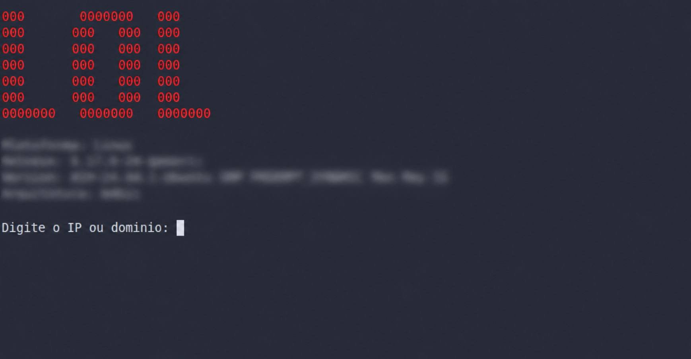

## LOLMAP – Scanner de Domínios e Portas
LOLMAP é uma ferramenta de segurança cibernética desenvolvida inteiramente em Python, sendo minha primeira contribuição para a área. Para utilizá-la, é necessário instalar as bibliotecas dns.resolver, dns.rdatatype e scapy, manualmente ou em um ambiente virtual. A execução se dá pelo terminal com o comando python3 LOLMAP.py. Durante a execução, o usuário informa um domínio, define a quantidade de threads (atenção: números excessivos podem interromper o funcionamento) e as portas a serem verificadas. A partir daí, a ferramenta envia datagramas com TTL progressivo para o alvo, identifica o IP correspondente, estima o sistema operacional com base nos valores de TTL retornados, realiza um ARP scan para obter exclusivamente o endereço MAC do servidor e, por fim, exibe os serviços e portas vulneráveis que se encontram abertas.

## Instalação
1. Clone este repositório.
2. Crie um ambiente virtual: `python3 -m venv venv && source venv/bin/activate`
3. Instale as dependências: `pip install -r requirements.txt`
4. Execute: `python3 LOLMAP.py`

## Licença

Este projeto está licenciado sob a Licença MIT. Você tem permissão para utilizar, copiar, modificar, distribuir e sublicenciar este software, desde que o aviso de direitos autorais e a licença original sejam mantidos.

Este software é fornecido "como está", sem qualquer garantia expressa ou implícita. Os autores não se responsabilizam por quaisquer danos, prejuízos ou consequências decorrentes do uso deste software.

O uso desta ferramenta deve estar em conformidade com as leis e regulamentações aplicáveis. O autor não se responsabiliza por usos indevidos, ilegais ou não autorizados realizados por terceiros.

Consulte o arquivo `LICENSE` para o texto completo da Licença MIT.
